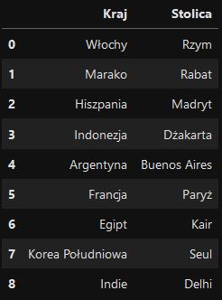

# Analiza Danych - Python, Pandas

## Wymagane zasoby

* Python3
* Jupyter Notebook
* Odpowiednie biblioteki

## Instalacja

### Instalacja Python

Pythona należy pobrać z oficjalnej strony:

LInk: [Python download](https://www.python.org/downloads/)

### Instalacja Jupyter Notebook

```
pip install notebook
```

### Instalacja bibliotek

#### Lista bibliotek

* NumPy
* Pandas
* Matplotlib
* Seaborn
* OpenPyXL

#### Instalacja

NumPy:
[Link do strony](https://numpy.org/install/)

```
pip install numpy
```

Pandas:
[Link do strony](https://pandas.pydata.org/docs/getting_started/install.html)

```
pip install pandas
```

Matplotlib:
[Link do strony](https://matplotlib.org/stable/#install)

```
pip install matplotlib
```

Seaborn:
[Link do strony](https://seaborn.pydata.org/installing.html)

```
pip install seaborn
```
OpenPyXL:
Pozwala odczytywać oraz zapisywać pliki Excel, jak również wykonywać w nich operacje. Więcej informacji znajduje się na stronie projektu
[Link do strony](https://openpyxl.readthedocs.io/en/stable/tutorial.html)

```
pip install xlwt openpyxl xlrd
```

## Pandas

### Tworzenie DataFrame

W API Pandas DataFrame jest odpowiednikiem Excel`owego arkusza. 
DataFrame możemy stworzyć na kilka sposobów. 
1. Za pomocą 'tablicy' ( Array ) z biblioteki NumPy
2. Przy użyciu Python`owej listy ( bez użycia NumPy )
4. Importując dane z pliku zewnętrznego
3. Używając 'słownika' ( Dictionary )

#### 1. Za pomocą 'tablicy' ( Array ) z biblioteki NumPy:

``` 
# Utworzenie tablicy:
tablica = np.array( [ [1, 2], [3, 4] ] )

# Utworzenie DataFrame:
dataFrameZTablicy = pd.DataFrame( tablica, columns = [ "kolumna1", "kolumna2" ] )
```

Podczas tworzenia DataFrame możemy przypisać nazwy dla kolumn ( columns ) i / lub wierszy ( index ). W tym celu podczas wywołania funkcji DataFrame(),
jako kolejne argumenty podajemy odpowiednio słowa kluczowe 'columns' oraz 'index', a po znaku '=' umieszczamy wartości.

```
dataFrame = pd.DataFrame( tablica, index = ["wiersz1", "wiersz2"], columns = ["kulumna1", "kolumna2" ])
```

#### 2. Przy użyciu Python`owej listy ( bez użycia NumPy ):

   ```
   # Utworznie lity:
   lista = [ [1, 2], [3, 4] ]
   
   # Utworznie DataFrame:
   dataFrameZListy = pd.DataFrame( lista, columns = [ "kolumna1", "kolumna2" ] )
   ```

   Utworzony DataFrame będzie identyczny jak poprzedni.

#### 3. Używając 'słownika' ( Dictionary ):
```
# Utworznie słownika ( dictionary data type ):
slownik = { "kolumna1": [1, 2], "kolumna2": [3, 4] }

# Utworzenie DataFrame:
dataFrameZSlownika = pd.DataFrame( slownik )
```

   Używając słownika nie musimy nadawać nazw kolumnom, ponieważ nazwy zostały już nadane przy tworzeniu 'dictionatry' i zostaną zastosowanie do DataFrame

#### 4. Importując dane z pliku zewnętrznego:

   Zależnie od rodzaju pliku z jakiego chcemy wczytać dane użyta funkcja będzie się różnić. \
   Dostępne funkcje importujące:
   - read_excel()
   - read_csv()
   - read_json()
   - read_pickle()
   - read_sql()

   ##### 1) Importowanie z plików Excel

   Importując dane z Excel`a należy użyć funkcji read_excel() i podać ścieżkę żądanego pliku.
   ```
   # Import danych z pliku Excel - jako argument podajemy ścieżkę oraz nazwę pliku.
   dataFrameZPlikuExcel = pd.read_excel( "dane/moj_excel.xlsx" )
   ```

   Wczytanie konkretnych kolumn ( tutaj: od A do D ) z konkretnego arkusza ( tutaj: Arkusz1 ) będzie wyglądać tak:

   ```
   dataFrameZPlikuExcel = pd.read_excel( "dane/moj_excel.xlsx", sheet = "Arkusz1", usecols = "A:D" )
   ```
[Więcej użytecznych informacji na temat wczytywania plików Excel można znaleźć w dokumentacji Pandas - klikając tutaj]( https://pandas.pydata.org/docs/reference/api/pandas.read_excel.html)

   ##### 2) Importowanie danych z plików o rozszerzeniu csv 

   Chyba najczęściej używanią funkcją jest read_csv(). Pozwala ona zaczerpnąć dane z pliku csv ( comma-separated value ), w którym wartości domyślnie są rodzielone przecinkami. 
   ```
   # Import danych z pliku csv - jako argument podajemy ścieżkę oraz nazwę pliku.
    dataFrameZPlikuCSV = pd.read_csv( "dane/moje_dane.csv" )
   ```
   Może zdarzyć się sytuacja, gdy separadtorem wartości jest inny symbol niż "," ( przecinek ). Przykładowo mogłaby to być pionowa kreska "|" ( ang. pipe ). Chcąc sprecyzować jakiego rozdzielacza wartości chcemy użyć posługujemy się parametrem "sep" i podajemy w cudzysłowie interesujący nas znak lub ciąg znaków, tutaj: "|".
   ```
   # Zmieniamy domyśly separator danych z "," na "|" przesyłając go parametrowi "sep"
   dataFrameZPlikuCSV = pd.read_csv( "dane/moje_dane.csv", sep = "|" )
   ```
   Tak, jak w przypadku importu danych z Excel`a, również i tu można na etapie tworzenia DataFrame wybrać kolumny, kótre zostaną wczytane. Podobnie jak  poprzednio używamy parametru "usecols" i podajemy mu nazwy kolumn jeśli takie istnieją, lub indeksy kolumn.
   ```
   # Parametr "usecols" dostaje nazwy kolumn
   dataFrameZPlikuCSV = pd.read_csv( "moje_dane.csv", usecols = ["Imię", "Nawzwisko", "Wiek"] )

   # Wskazujemy kolumny po numerze indeksu kolumny
   dataFrameZPlikuCSV = pd.read_csv( "moje_dane.csv", usecols = [0, 1, 4] )
   ```
[Więcej użytecznych informacji na temat wczytywnia danych a plików.csv można znaleźć w dokumentacji Pandas - klikając tutaj](https://pandas.pydata.org/docs/reference/api/pandas.read_csv.html)

## Wybieranie / zaznaczanie danych
Najbardziej elementarną operacją jaką przyjdzie nam najczęściej wykonywać jest selekcja części danych ze zbioru jakim jest DataFrame ( tabela ). Do konkretnych części tabeli możemy odwoływać się na wiele sposobów, w zależności jakieg oefektu oczekujemy. Przyjrzyjmy się najczęściej wykorzystywanym sposobom, używając prostej tabeli, którą sami sobie przygotujemy.
```
# Przykładawa tabla danych ( DataFrame ) - utworzony za pomocą listy
dane = [ ["Ala", "Nowak", 20], ["Urszula", "Kowalska", 34], ["Karol", "Strasburger", 76] ]
tabela = pd.DataFrame( dane, columns = ["Imię", "Nazwisko", "Wiek"] )
```
Rezultat:


### Odwoływanie się do konkretnych kolumn

1. Wyszczególnienie nazw ( etykiet ) interesujących nas kolumn
2.
3. Użycie funkcji iloc()

#### 1. Wyszczególnienie nazw ( etykiet ) interesujących nas kolumn

Zdecydowanie najprostrszym sposobem selekcji konkretnej kolumny, bądź kolumn jest wskazanie bezpośrednio po etykiecie ( nazwie ) kolumny. Robimy to poprzez podanie nazwy naszej tabeli oraz umieszczenie w nawiasach kwadratowych etykiety interesującej nas kolumny. Taki obiekt możemy przypisać do zmiennej, tutaj "kolumna".
```
# Selekcja jednej kolumny z tabeli danych ( DataFrame )
kulumna = tabela[ "Imię" ]
```

Wybranie kolumny powoduje wydzielenie części danych. 


Tak otrzymane dane są typu: pandas.core.series.Series. Możemy to sprawdzić za pomocą funkcji type().

```
# Sprawdzenie typu danych
type( tabela )
```
Ten sam efekt można uzyskać używając innego zapisu:
```
# Inna metoda delekcji kolumn
kolumna = tabela.Imię
```
Zamiast nawiasów kwadratowych stosujemy kropkę, a po niej podajemy nazwę kulumny. Zwróć uwagę, że nazwa kolumny nie znajduje sie w cudzysłowie. 

W celu wybrania większej ilości kolumn możemy napisać:

```
# Wybór większej liczby kolumn
kilkaKolumn =  tabela[ ["Imię", "Nazwisko"] ]
```

W wyniku czego dostajemy nowy DataFrame:


```
# Sprawdznie typu danej
type( kilkaKolumn )
```

Wywołując funkcję type() dla obiektu 'kilkaKolumn' otrzymujemy jako rezultat: pandas.core.frame.DataFrame, a więc mamy potwierdzenie, że jest to DataFrame. 

#### 2.
#### 3. Użycie funkcji iloc()
Funkcja iloc() daje możliwość wybrania konkretnej "komórki" z daną z naszej tabeli polegając na pozycji. Jej użycie jest proste i przebiega według schematu:
```
interesujacaNasKomorkaDanych = tabela.iloc[ odWiersza : doWiersza, odKolumny : doKolumny ]
```
W tym momencie najbardziej interesuje nas pozyskanie kolumny, więc pierwszy argument ( do przecinka "," ) pomijamy i zostawiamy tam dwukropek ":". Jako drugi argiment podajemy pozycję kolumn - numeracja odbywa się jak zawsze od "0".
```
kolumny = tabela.iloc[ : , 1:3 ]
```
Co daje w rezultacie: \
 \
W ten sposób wybraliśmy z tabeli danych kolumny, które znajdowały się między pozycją "1" włącznie oraz z wyłączeniem pozycji "3". Wpisując "1:2" zostałaby wzięta tylko kolumna o pozycji "1". Matematycznie rzecz ujmując podajemy przedział prawostronnie otwarty < 1, 3 ). 

### Odwoływanie się do konkretnych wierszy
Wybór konkretnego wiersza rózwnież można zrealizować w różny sposób. Możemy odwołać się do niego poprzez nr indeksu, nazwę, czy też przefiltrować pod kątej wartości lub spełnienia zadanego warunku.

Selekcji wierszy można dokonnać poprzez:
1. Podanie nazwy wiersza do funkcji składowej loc()
2. Wskazanie wiersza poprzez indeks - funckja składowa iloc()
3. Użycie wyrażenia warunkowego do przefiltrowania wierszy

#### 1. Podanie nazwy wiersza do funkcji składowej loc()
W przypadkum, gdy wiersze są nazwane, możemy użyć tej nazwy do ich wywołania. Nazwa wiersza jest etykietą tego wiersza.
```
 # Wybranie jednego wiersza po nazwie:
 # Zostanie wybrany 1 wiersz o nazwie "pierwszy"
 wiersz = tabela.loc["pierwszy"]

 # Wybranie kilku wierszy używając zakresu:
 # Zostaną wybrzne wszystkie wiersze pomiędzy "pierszym" a "trzecim" z nimi włącznie
 zakresWierszy = tabela.loc["pierwszy" : "trzeci"]

 # Wybranie kilku wierszy przy użyciu listy
 # Zostaną wybrane 2 wiersze o nazwach "pierwszy" oraz "trzeci"
 listaWierszy = tabela.loc[ ["pierwszy", "trzeci"] ]
```
Jeżeli natomiast wiersze nie mają nazw - to posługujemy sie numerami indeksów. Domyślnie indeksowanie odbywa się od zera, ale nic nie szkodzi na przeszkodzie, by nadać własne numery indeków. Ponumerowane indeksy równiesz są etykietą. Selekcja odbywa się na tej samej zasadzie co poprzednio, z tą różnicą, że numeru indeksu nie ujmujemy w cudzysłów ( "" ).
```
 # Wybranie jednego wiersza po indeksie:
 wiersz = tabela.loc[0]

 # Wybranie kilku wierszy używając zakresu:
 zakresWierszy = tabela.loc[0:2]

 # Wybranie kilku wierszy przy użyciu listy
 listaWierszy = tabela.loc[ [0, 2] ]
```
Co ważne, funkcja loc() wskazuje elementy używając etykiety ( nazwy ) wiersza. Ma to bezpoeślrednie przełożenie na wybór wierszy przy użyciu zakresu np. [0:4]. W ten sposób zostaną dostacrczone wiersze o indeksach pomiędzy 0 a 4 niezaleźnie od kolejnosći w jakiej znajdują się w tabeli. Dla liczb odbywa się to narastajaco, natomiast dla nazw - alfabetycznie. Wobec tego w tym przykładzie dostaniemy wiersze o etykiecie 0, 1, 2, 3, 4.
To tu pojawia się zasadniacza różnica między funkcjami loc() oraz iloc(), gdzie ta druga bierze pod uwagę pozycję w tabeli, a nie etykietę wiersza.

#### 2. Wskazanie wiersza poprzez indeks - funckja składowa iloc()


#### 3. Użycie wyrażenia warunkowego do przefiltrowania wierszy
 

## Dodawanie kolumn i wierszy do tabeli ( DataFrame )
### Dodawanie kolumn

1. Poprzez odwołanie się do nieistniejącej nazwy kolumny
2. Funkcją składową insert()
3. Za pomocą funkcji concat()

Przygotujmy zestaw danych, na kórych będzimy testować te metody.
```
# Przygotowanie zestawu danych
dane = {
        "Liczba1": [ 20, 43, 84, 9, 37 ],
        "Liczba2": [ 12, 68, 33, 71, 18 ]
       }

# Zamiana słownika na DataFrame
tabela = pd.DataFrame( dane )
```
Tak wygląda nasz DataFrame: \


#### 1. Poprzez odwołanie się do nieistniejącej nazwy kolumny
Zdecydowanie najprostszą metodą tworzenia nowej kolumny w tabeli jest użycie składni:
```
# Pseudokod
tabela["nazwa_nowej_kulumny"] = wartości
```
Tworzymy nową kolumnę o nazwie "Suma" i wypełniamy ją wartością wyrażenia po znaku "=". Dokonaliśmy tu zsumowania wartości z podanych kolumn dla każdego z wierszy. Tak powstały zestaw danych został przypisany do naszej nowej kolumny.
```
# Dodanie nowej kolumny, która zawiera sumę wartości z 2 wskazanych kolumn
tabela["Suma"] = tabela["Liczba1"] + tabela["Liczba2"]
```
Oczywiście nic nie stoi na przeszkodzi wybrać interesujące nas kolumny innym sposobem. Dla przypomnienia użyliśmy funkcji iloc():
```
# Tutaj kulumny zostały wybrane po ich pozycji w tabeli
tabela["suma"] = tabela.iloc[:, 0 ] + tabela.iloc[:, 1]
```
Efekt jest ten sam: \


#### 2. Funkcją składową insert()
Inny sposobem jest użycie funkcji składowej klasy DataFrame - insert(). Jej zdecydowaną przewagą jest możliwość wybrania miejsca w tabeli, w które zostanie wstawiona nowa kolumna. 
Składnia funkcji insert jest nasępująca:
```
# Pseudokod
tabela.insert( pozycja_w_tabeli, "nazwa_nowej_kolumny", wartości )
```
W naszym przykadzie wstawimy nowe dane między kolumny o etykiecie "Liczba2" oraz "Suma". Pozycja w tabeli jest liczona od lewej począwszy od 0, zatem naszą pozycją będzie 2. Tym razem obliczymy różnicę wartości liczbowych, stąd taka też etykieta oraz wartości.
```
# Dodanie nowej kolumny funkcją składową insert()
tabela.insert( 2, "Różnica", tabela["Liczba1"] - tabela["Liczba2"] )
```
Tak wygląda teraz nasza tabela: \


#### 3. Za pomocą funkcji concat()
Funkcja concat() łączy dane zawarte w różnych tabelach. 
Przygotowujemy odpowiedni DataFrame na przykład dla odmiany, w ten sposób:
```
# Przygotowanie nowego DataFrame
iloczyn = pd.DataFrame( tabela.iloc[:, 0] * tabela.iloc[:, 1], columns = ["Iloczyn"] )
```
Następnie postępujemy według wzoru:
```
# Pseudokod
tabela = pd.concat( lista_tabel_do_złączania, axis = oś_łączenia, ignore_index = czy_ignorować_indexy )
```
Pierszym argumentem są tabele, które chcemy zołączyć zorganizowane w Python`ową listę obiektów. Parametr "axis" określa oś w któej chcemy złączyć dane - przyjmuje wartość: "0" dla wierszy oraz "1" dla kolumn. Wartością "ignore_index" w tym przypadku będzie "False", ponieważ chcemy zachować etykiety ( nazwy ) kolumn. Ten ostatni parametr ustawiony na "True" spowodowałby odrzucenie istniejących etykiet oraz ponumerowania kolumn od "0" ( będzie to użyteczne przy dołącazaniu wierszy ). \
Nasze polecenie wygląda tak:
```
# Dodawanie kolumny funkcją składową concat()
tabela = pd.concat( [tabela, iloczyn], axis = 1, ignore_index = False )
```
Tabela po dodaniu kolumny "Iloczyn": \


Operację arytmetyczną możemy przeprowadzić również wewnątrz funkcji concat(). Rezultatem wyrażenia: tabela["Liczba1"] / tabela["Liczba2"] jest tymczasowy obiekt klasy DataFrame, a więc nadaje się do użycia we wspomnianej funkcji. \
Niestety tracimy tu możliwość bezpośredniego nadania etykiety nowej kolumnie. Jest to wykonalne za pomocą parametru "names", ale wymaga to wcześniejszego sporządzenia listy etykiet, gdyż podmieniamy w ten sposób wszystkie w powstałym DataFrame. Wydaje mi się, że prostszą metodą będzie zmiana nazwy kolumny po fakcie. \

Najpiew tworzymy nową kolumnę:
```
# Możemy też to zrobić w jednej linijce, ale kolumna pozostaje nienazwana ( jej etykietą będzie numer )
tabela = pd.concat( [tabela, tabela["Liczba1"] / tabela["Liczba2"] , axis = 1, ignore_index = False )
```
Następnie zmieniamy nazwę wybierając jedną z metod:
```
# Zmiana nazwy kolumny z 0 na "Iloraz"
tabela.rename( columns = { 0 : "Iloraz" }, inplace = True )

# Zmiana nazwy kolumny - pozyskanie nazwy poprzez wycągnięcie jej z atrubutu columns dla pierwszej od końca kolumny
tabela.rename( columns = { tabela.columns[-1] : "Iloraz" }, inplace = True )

# Inna metoda zmiany napisu na etykiecie
tabela.columns = tabela.columns.str.replace("0", "Iloraz")
```
W pierwszym przypadku używamy funkcji rename() na naszej tabeli z danymi. Jako parametr "columns" przesyłamy slownik ( dictionary ) zawierający nazwę obecną nazwę kolumny oraz nową nazwę. Jako, że wsyztkie wcześniejsze kolumny były nazwane to ta nowo utworzona przyjmuje etykietę: "0". Wobec tego zamienniamy "0" na ciąg znaków "Iloraz". \
Bardziej odporną na błędy wersją tej metody jest wskazanie nazwy etykiety poprzez jakąś funkcję lub odwołanie się do atrybutu obiektu klasy DataFrame. W drugim przykładzie w nawiasach klamrowych "{}" jako pierszy argument wywołaliśmy atrybut "columns", który zwraca serię danych. Z tej serii bierzemy ostatni element przez podanie w nawiasach kwadratowych wartości "-1" ( symbolizuje to pierszy element kolekccji od końca ). W tym elemencie kryje się nazwa etykiety ostatniej kolumny tabeli - czyli tej, o którą nam chodziło. Jak wiemy kolumna została dodane na koniec tabeli zatem wszystko się zgadza, dopóki zniamę nazwy dokonujemy zaraz po wprowadzeniu nowej kolumny. \
Drugą metodą jest użycie funkcji, która działa na ciągu znaków - str.replace(), by znależć i zamienić ciąg "0" na "Iloraz" w atrybucie "columns". Tak zmodyfikowaną serię danych przypisujemy do "tablela.columns". 

W tabeli pojawia się nowo dadana kolumna o nazwie "Iloraz": \


### Dodawanie wierszy
Wróćmy do pierwotnej wejsji tabeli - tej, gdzie mamy wyłącznie kolumny "Liczba1" i "Liczba2". Przygotujmy równiez wiersze do dodania do tabeli w dwóch formmach: w postaci listy oraz słownika.
```
# Lista
nowyWierszLista = [ 398, 141 ] 

# Słownik
nowyWierszSlownik = { "Liczba1": 398, "Liczba2": 141 }
```

1. Posłużenie się funkcją loc[]
2. Funkcja składowa insert()
3. Użycie funkcji concat()

### 1. Posłużenie się funkcją loc[]
Funkcja loc[] pozwala nam na dodanie nowego wiersza ...Użycie funkcji len() gwarantuje nam, że wiersz zostanie dodany na końcu tabeli. Funkcja ta zwraca ilość wierszy w tabeli, wiemy, że w Pythonie elementy numerujemy od zera "0", wobec tego element on numerze takim jak ich ilość będzie wskazywał na miejsce tuż za końcem tabeli.

```
# Dodanie wiersza na końcu tabeli
tabela.loc[ len(tabela) ] = nowyWierszLista
tabela.loc[ len(tabela) ] = nowyWierszSlownik
```
 \
Możemy też nazwać nasz nowy wiersz, co może być przydatne np. przy tworzeniu podsumowania całej kolumny poniżej. Wiersz zostanie dodany automatycznie na końcu tabeli.
```
# Utworzenie wiersza o konkretnej nazwie ( etykiecie )
tabela.loc[ "Suma", : ] = [ tabela["Liczba1"].sum(), tabela.Liczba2.sum() ]
```
W wyniku czego dostaniemy: \
 
### 2. Funkcją składową insert()
### 3. Użycie funkcji concat()

## Usuwanie kolumn i wierszy z tabeli ( DataFrame )

### Usuwanie kolumn
#### 1. Funkcja drop()
Za pomocą funkcji składowej drop() możemy usunąć zarównno wiersze jak i kolumny z tabeli ( DataFraame ) Wskazania, o którą konkretnie kolumnę lub wiersz nam chodzi  posługujemy się emblematem ( nazwą ). W obu przypadkach możemy posłużyć się dwoma składniami.
Pierwszym sposobem jest podanie nazwy kolumny lub listy nazw oraz określenie osi w jakiej ma być zrealizowane zadanie ( dla kolumn  jest to "1" ).
```
# Dla pojedynczej kolumny
tabela.drop( "Nazwisko", axis = 1)

# Dla lisy kolumn
tabela.drop( ["Nazwisko", "Wiek"], axis = 1 )
```
Drugim równoważnym rozwiązaniem jest podanie nazw do parametru "columns".
```
# Podajemy tylko jeden parametr
tabela.drop( columns = "Nazwisko" )
```

### Usuwanie wierszy
#### 1. Funcja drop()
Chcąc usunąć wiersze postępujemy analogicznie jak w przypadku kolumn, przy czym parametr "axis" przyjmuje wartość "0" lub wogóle go nie podajemy, gdyż domyślnie jest zerem. W drugim sposobie zamieniamy parametr "columns" na "index".
```
# Pierwsza metoda
tabela.drop( "Wiersz3", axis = 0)

# Tylko z jednym parametrem
tabela.drop( index = "Wiersz3" )
```

## Łączenie danych z różnych tabel
Biblioteka Pandas umożliwia łączenie tabel z danymi poprzed dopasowywanie ich do siebie wegług kryterium. Najlepszym odpowiednikiem z programu Excel jest funkcja WYSZUKAJ.PIONOWO().
Załóżmy, że mamy dwa zestawy danych zebrancyh w tabletach: 
```
# Tworzymy zestawy danych - tym razem za pomoca słowników ( dictionaries )

tabelaA = { "Kraj": ["Włochy", "Marako", "Hiszpania", "Indonezja", "Argentyna","Francja", "Egipt", "Korea Południowa", "Indie"],
            "Stolica": ["Rzym", "Rabat", "Madryt", "Dżakarta", "Buenos Aires", "Paryż", "Kair", "Seul", "Delhi"] }

tabelaB = { "Kraj": ["Francja", "Gruzja", "Hiszpania", "Włochy", "Nigeria", "Argentyna", "Egipt", "Indie"],
            "Ludność [mln]": [67.75, 3.70, 47.42, 59.11, 213.4, 45.81, 109.3, 1408] }

# Na podstawie tabalaA oraz tabelaB generujemy DataFrame
tabelaADataFrame = pd.DataFrame( tabelaA )
tabelaBDataFrame = pd.DataFrame( tabelaB )
```
Tak wyglądają tabele wyrenderowane w Jupyter Notebook:




Przyjmijmy, że naszym celem jest zestawienie informacji na temat kraju stolicy oraz zamieszkującej go ludności razem w jednej tabeli. W tym celu używamy funkcji merge() z biblioteki Pandas.
Domyślnie wynikiem scalenia jest część wspólna dla dla obu zestawów danych. Na szczęście nie jest to jedyna możliwość.
Wyróżniamy 4 sposoby łączenia tabel danych:
1. Scalenie wewnętrzne ( inner merge )
2. Scalenie zewnętrzne ( outer merge )
3. Scalenie lewostrnonne ( left merge )
4. Scalenie prawostronne ( right merge )
5. Scalenie na krzyż ( cross merge )

### 1. Scalenie wewnętrzne ( inner merge )
Scalenie wewnętrzne jest opcją domyślną, zatem jeśli nie wyspecyfikujemy rodzaju scalenia to nastąpi to właśnie w ten sposób. Polega ono na znalezieniu części wspólnej zestawów danych. W naszym przykładzie częścią wspólną będzią kraje, dla których da się skompletować całość danych tj. nazwę kraju, stolicę oraz liczbę ludności.

<font color = "red"> =======>( img inner merge conception ) </font>
```
# Użycie funkcji merge() z parametrem 'how' o wartości 'inner'
scalenieWewnetrzne = pd.merge( tabelaADataFrame, tabelaBDataFrame, how = "inner" )

# Lub też krócej
scalenieWewnetrzne = pd.merge( tabelaADataFrame, tabelaBDataFrame )
```
A oto rezultat takiego scalenia: \
 \
Jak widać kraje, które nie występowały w drugim zestawie danych, nie zostały uwzględnione w końcowej tabeli.

### 2. Scalenie zewnętrzne ( outer merge )
Ten rodzaj scalenia uwzgęnia wszystkie dane, zatem w rezultacie powinniśmy otrzymać tabelę, w której bedą wszyskie pojawiające się kraje. Miejsca, dla których brakuje danych pozostaną puste - o tym, że komórka jest pusta informuje nas symbol 'NaN' ( skrót: "Not a Number" ). \
<font color = "red"> =======>( img outer merge conception ) </font> 
```
# Użycie funkcji merge() z parametrem 'how' o wartości 'outer'
scalenieZewnetrzne = pd.merge( tabelaADataFrame, tabelaBDataFrame, how = "outer" )
```
 \

### 3. Scalenie lewostrnonne ( left merge )
<font color = "red"> =======>( img left merge conception ) </font> \
Efektem scalenia lewostronnego jest zachowanie całej pierwszej tabeli oraz dołączenie do niej wartości z drugiej. Wiersze, dla których brak dopasowania w nowo powstałej tabeli będą zawierały puste komórki ( 'NaN' ).
```
# Użycie funkcji merge() z parametrem 'how' o wartości 'left'
scalenieLewostronne = pd.merge( tabelaADataFrame, tabelaBDataFrame, how = "left" )
```
A oto wydruk powyższej tabeli: \
 \


### 4. Scalenie prawostronne ( right merte )
<font color = "red"> =======>( img right merge conception ) </font> \
Scalając prawostronnie bierzmy wszystkie dane z drugiej tabeli i dodajemy do niej dppasowanie wartości w pierwszej tabeli. Tutaj również braki w danych objawiają się pustą komórką. 
```
# Użycie funkcji merge() z parametrem 'how' o wartości 'right'
scaleniePrawostronne = pd.Prawostronne( tabelaADataFrame, tabelaBDataFrame, how = "right" )
```
W wyniku czego dostajemy: \
 \

### 5. Scalenie na krzyż ( cross merge )
<font color = "red"> =======>( img cross merge conception ) </font> \

### Obserwacje
Zwróć uwagę na rozmiar otzymywanych tabel w zależności od rodzaju użytego scalenia. To ile nasza wyjściowa tabela będdzie miała wierszy zależy od tego co było bazą do scalenia. W scaleniu lewostronnym bazą była pierwsza tabela ( lewa ), więc ilośći wierszy jest identyczna jak w pierwszej tabeli. Scalając prawostronnie naszą bazą jest druga tabela ( prawa ), zatem ilość wierszy będzie taka jak w prawej tabeli. W efekcje wewnętrzenego scalenia dostaniemy wiersze, które możemy skasyfikować jako część wspólną, natomiast wynikiem zewnętrzniego jest suma unikalnych wierszy. Dokonując scalenia krzyżowego ilość wierszy jest iloczynem ilości wierszy obu tabel ( zestawienie każdego elementu z każdym ).

## Scalanie przy użyciu funkcji join()

## Filtrowanie tabeli
## Sortowanie tabeli

# Wizualizacja danych
## Narzędzia do wizualizacji danych
## Tworzenie wykresów

## Web scraping - wyciądanie danych ze stron internetowych


## Źródła

https://www.youtube.com/watch?v=WcDaZ67TVRo \
https://www.edlitera.com/blog/posts/pandas-vs-excel-comparison \
https://www.edlitera.com/en/blog/posts/pandas-merge-dataframes \
https://www.edlitera.com/en/blog/posts/pandas-derived-columns \
https://sparkbyexamples.com/pandas/pandas-sort-dataframe-by-multiple-columns/ 
https://pandas.pydata.org/docs/getting_started/intro_tutorials/03_subset_data.html \
https://www.listendata.com/2019/07/how-to-filter-pandas-dataframe.html
