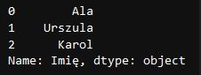

# Analiza Danych - Python, Pandas

## Wymagane zasoby

* Python3
* Jupyter Notebook
* Odpowiednie biblioteki

## Instalacja

### Instalacja Python

Pythona należy pobrać z oficjalnej strony:

LInk: [Python download](https://www.python.org/downloads/)

### Instalacja Jupyter Notebook

```
pip install notebook
```

### Instalacja bibliotek

#### Lista bibliotek

* NumPy
* Pandas
* Matplotlib
* Seaborn

#### Instalacja

NumPy:
[Link do strony](https://numpy.org/install/)

```
pip install numpy
```

Pandas:
[Link do strony](https://pandas.pydata.org/docs/getting_started/install.html)

```
pip install pandas
```

Matplotlib:
[Link do strony](https://matplotlib.org/stable/#install)

```
pip install matplotlib
```

Seaborn:
[Link do strony](https://seaborn.pydata.org/installing.html)

```
pip install seaborn
```
OpenPyXL:
Pozwala odczytywać oraz zapisywać pliki Excel, jak również wykonywać w nich operacje. Więcej informacji znajduje się na stronie projektu
[Link do strony](https://openpyxl.readthedocs.io/en/stable/tutorial.html)

```
pip install xlwt openpyxl xlrd
```

## Pandas

### Tworzenie DataFrame

W API Pandas DataFrame jest odpowiednikiem Excel`owego arkusza. 
DataFrame możemy stworzyć na kilka sposobów. 

1. Za pomocą 'tablicy' ( Array ) z biblioteki NumPy:

``` 
# Utworzenie tablicy:
tablica = np.array( [ [1, 2], [3, 4] ] )

# Utworzenie DataFrame:
dataFrameZTablicy = pd.DataFrame( tablica, columns = [ "kolumna1", "kolumna2" ] )
```

Podczas tworzenia DataFrame możemy przypisać nazwy dla kolumn ( columns ) i / lub wierszy ( index ). W tym celu podczas wywołania funkcji DataFrame(),
jako kolejne argumenty podajemy odpowiednio słowa kluczowe 'columns' oraz 'index', a po znaku '=' umieszczamy wartości.

```
dataFrame = pd.DataFrame( tablica, index = ["wiersz1", "wiersz2"], columns = ["kulumna1", "kolumna2" ])
```

2. Przy użyciu Python`owej listy ( bez użycia NumPy ):

   ```
   # Utworznie lity:
   lista = [ [1, 2], [3, 4] ]
   
   # Utworznie DataFrame:
   dataFrameZListy = pd.DataFrame( lista, columns = [ "kolumna1", "kolumna2" ] )
   ```

   Utworzony DataFrame będzie identyczny jak poprzedni.

3. Używając 'słownika' ( Dictionary ):
```
# Utworznie słownika ( dictionary data type ):
slownik = { "kolumna1": [1, 2], "kolumna2": [3, 4] }

# Utworzenie DataFrame:
dataFrameZSlownika = pd.DataFrame( slownik )
```

   Używając słownika nie musimy nadawać nazw kolumnom, ponieważ nazwy zostały już nadane przy tworzeniu 'dictionatry' i zostaną zastosowanie do DataFrame

4. Importując dane z pliku zewnętrznego:

   Zależnie od rodzaju pliku z jakiego chcemy wczytać dane użyta funkcja będzie się różnić.
   Importując dane z Excel`a należy użyć funkcji read_excel() i podać ścieżkę żądanego pliku.

   ```
   dataFrameZPlikuExcel = pd.read_excel( "moj_excel.xlsx" )
   ```

   Wczytanie konkretnych kolumn ( tutaj: od A do D ) z konkretnego arkusza ( tutaj: Arkusz1 ) będzie wyglądać tak:

   ```
   dataFrameZPlikuExcel = pd.read_excel( "moj_excel.xlsx", sheet = "Arkusz1", usecols = "A:D" )
   ```

   Inne funkcje importujące:
   
   * read_csv()
   
   - read_excel()
   - read_json()
   - read_pickle()
   - read_sql()

## Wybieranie / zaznaczanie danych

### Odwoływanie się do konkretnych kolumn


```
# Przykładawa tabla danych ( DataFrame ) - utworzon za pomocą listy
dane = [ ["Ala", "Nowak", 20], ["Urszula", "Kowalska", 34], ["Karol", "Strasburger", 76] ]
tabela = pd.DataFrame( dane, columns = ["Imię", "Nazwisko", "Wiek"] )
```

Rezultat:


```
# Selekcja jednej kolumny z tabeli danych ( DataFrame )
kulumna = tabela[ "Imię" ]
```

Wybranie kolumny powoduje wydzielenie części danych. 



Tak otrzymane dane są typu: pandas.core.series.Series. Możemy to sprawdzić za pomocą funkcji type().

```
# Sprawdzenie typu danych
type( tabela )
```
Ten sam efekt można uzyskać używając innego zapisu:
```
# Inna metoda delekcji kolumn
kolumna = tabela.Imię
```
Zamiast nawiasów kwadratowych stosujemy kropkę, a po niej podajemy nazwę kulumny. Zwróć uwagę, że nazwa kolumny nie znajduje sie w cudzysłowie. 

W celu wybrania większej ilości kolumn możemy  użyć komendy:

```
# Wybór większej liczby kolumn
kilkaKolumn =  tabela[ ["Imię", "Nazwisko"] ]
```

W wyniku czego dostajemy nowy DataFrame:


```
# Sprawdznie typu danej
type( kilkaKolumn )
```

Wywołując funkcję type() dla obiektu 'kilkaKolumn' otrzymujemy jako rezultat: pandas.core.frame.DataFrame, a więc mamy potwierdzenie, że jest to DataFrame. 

## Łączenie danych z różnych tablic
Biblioteka Pandas umożliwia łączenie tabel z danymi poprzed dopasowywanie ich do siebie wegług kryterium. Najlepszym odpowiednikiem z programu Excel jest funkcja WYSZUKAJ.PIONOWO().
Załóżmy, że mamy dwa zestawy danych zebrancyh w tabletach: 
```
# Tworzymy zestawy danych - tym razem za pomoca słowników ( dictionaries )

tabelaA = { "Kraj": ["Włochy", "Marako", "Hiszpania", "Indonezja", "Argentyna","Francja", "Egipt", "Korea Południowa", "Indie"],
            "Stolica": ["Rzym", "Rabat", "Madryt", "Dżakarta", "Buenos Aires", "Paryż", "Kair", "Seul", "Delhi"] }

tabelaB = { "Kraj": ["Francja", "Gruzja", "Hiszpania", "Włochy", "Nigeria", "Argentyna", "Egipt", "Indie"],
            "Ludność [mln]": [67.75, 3.70, 47.42, 59.11, 213.4, 45.81, 109.3, 1408] }

# Na podstawie tabalaA oraz tabelaB generujemy DataFrame
tabelaADataFrame = pd.DataFrame( tabelaA )
tabelaBDataFrame = pd.DataFrame( tabelaB )
```
Tak wyglądają tabele wyrenderowane w Jupyter Notebook:


Przyjmijmy, że naszym celem jest zestawienie informacji na temat kraju stolicy oraz zamieszkującej go ludności razem w jednej tabeli. W tym celu używamy funkcji merge() z biblioteki Pandas.
Domyślnie wynikiem scalenia jest część wspólna dla dla obu zestawów danych. Na szczęście nie jest to jedyna możliwość.
Wyróżniamy 4 sposoby łączenia tabel danych:
1. Scalenie wewnętrzne ( inner merge )
2. Scalenie zewnętrzne ( outer merge )
3. Scalenie lewostrnonne ( left merge )
4. Scalenie prawostronne ( right merte )
5. Scalenie na krzyż ( cross merge )

### 1. Scalenie wewnętrzne ( inner merge )
Scalenie wewnętrzne jest opcją domyślną, zatem jeśli nie wyspecyfikujemy rodzaju scalenia to nastąpi to właśnie w ten sposób. Polega ono na znalezieniu części wspólnej zestawów danych. W naszym przykładzie częścią wspólną będzią kraje, dla których da się skompletować całość danych tj. nazwę kraju, stolicę oraz liczbę ludności.

<font color = "red"> =======>( img inner merge conception ) </font>
```
# Użycie funkcji merge() z parametrem 'how' o wartości 'inner'
scalenieWewnetrzne = pd.merge( tabelaADataFrame, tabelaBDataFrame, how = "inner" )

# Lub też krócej
scalenieWewnetrzne = pd.merge( tabelaADataFrame, tabelaBDataFrame )
```
A oto rezultat takiego scalenia: \
 \
Jak widać kraje, które nie występowały w drugim zestawie danych, nie zostały uwzględnione w końcowej tabeli.

### 2. Scalenie zewnętrzne ( outer merge )
Ten rodzaj scalenia uwzgęnia wszystkie dane, zatem w rezultacie powinniśmy otrzymać tabelę, w której bedą wszyskie pojawiające się kraje. Miejsca, dla których brakuje danych pozostaną puste - o tym, że komórka jest pusta informuje nas symbol 'NaN' ( skrót: "Not a Number" ). \
<font color = "red"> =======>( img outer merge conception ) </font>
```
# Użycie funkcji merge() z parametrem 'how' o wartości 'outer'
scalenieZewnetrzne = pd.merge( tabelaADataFrame, tabelaBDataFrame, how = "outer" )
```
 \

### 3. Scalenie lewostrnonne ( left merge )
### 4. Scalenie prawostronne ( right merte )
### 5. Scalenie na krzyż ( cross merge )

## Źródła

https://www.youtube.com/watch?v=WcDaZ67TVRo \
https://www.edlitera.com/blog/posts/pandas-vs-excel-comparison \
https://www.edlitera.com/en/blog/posts/pandas-merge-dataframes \
https://www.edlitera.com/en/blog/posts/pandas-derived-columns \
https://sparkbyexamples.com/pandas/pandas-sort-dataframe-by-multiple-columns/ 

